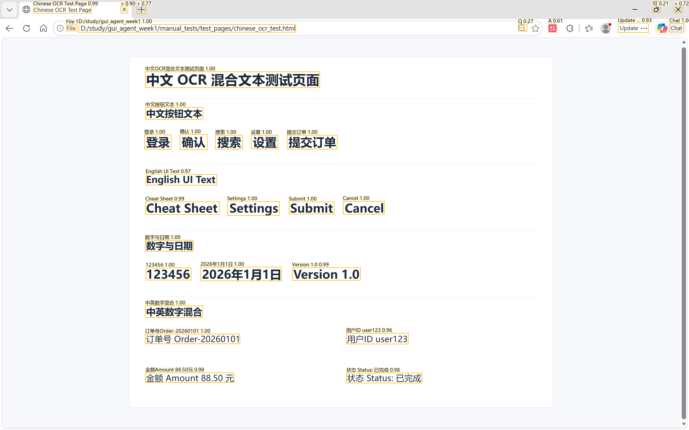
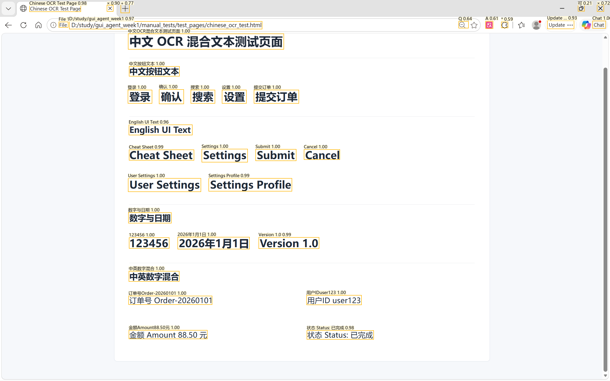

# GUI 智能体补充实验报告

本报告只补充导师本次要求新增的实验内容，原有环境搭建、基础截图、OCR、鼠标键盘控制等内容不再重复展开。

## 1. 实验目标

本次补充实验围绕以下问题展开：

- 验证 PaddleOCR 中文模型对中文、英文、数字混合页面的识别效果。
- 增强文本查找能力，支持模糊匹配、返回所有匹配项、正则匹配。
- 解决 Windows 高 DPI 和多显示器场景下截图坐标、点击坐标可能不一致的问题。
- 增加异常处理和日志，避免常见错误直接导致程序崩溃。
- 增加完整链路性能测试，统计截图、OCR、文本查找、点击各环节耗时。

## 2. 实验思路

GUI 智能体的基础链路可以拆成四步：

```text
屏幕截图 -> OCR 识别 -> 文本/元素定位 -> 鼠标点击
```

因此本次补充实验没有单独堆叠新功能，而是围绕这条链路增强可靠性：

- 对 OCR：准备可控的中英数字混合 HTML 页面，使用预设关键词列表计算匹配率。
- 对文本查找：在 OCR 结果 `UIElement` 上做匹配，而不是重新截图，避免查找逻辑和 OCR 逻辑混在一起。
- 对 DPI / 多显示器：截图时支持 `monitor_index`，点击时把显示器内坐标转换为全局屏幕坐标。
- 对异常处理：截图失败、OCR 失败、正则写错、鼠标控制失败时记录日志，并返回明确结果。
- 对性能：复用同一个 OCR engine，避免 10 次测试重复加载模型，使耗时更接近真实运行链路。

## 3. 关键实现

### 3.1 中文 OCR 测试页面

测试页面位于：

```text
manual_tests/test_pages/chinese_ocr_test.html
```

页面包含中文按钮、英文 UI 文本、纯数字、日期和中英数字混合文本，例如：

```text
登录 / 确认 / 搜索 / 设置 / 提交订单
Cheat Sheet / Settings / Submit / Cancel
123456 / 2026年1月1日 / Version 1.0
订单号 Order-20260101 / 用户ID user123 / Amount 88.50
```

OCR 脚本位于：

```text
manual_tests/manual_ocr.py
```

代码位置：

```text
manual_tests/manual_ocr.py:12-32   定义 EXPECTED_TERMS 预期关键词
manual_tests/manual_ocr.py:48-67   截图、OCR、标注图生成、match_rate 结果写入
manual_tests/manual_ocr.py:82-88   预期关键词与 OCR 文本的归一化匹配
```

核心思路是：先截图，再调用 `run_ocr()`，然后把识别出的文本和预设 `EXPECTED_TERMS` 做归一化匹配，得到 `match_rate`。

```python
recognized_texts = [element.text for element in elements]
matched_terms = _match_expected_terms(EXPECTED_TERMS, recognized_texts)
match_rate = match_count / expected_terms_count
```

### 3.2 文本查找增强

核心函数位于：

```text
gui_agent/screen_perception.py
```

代码位置：

```text
gui_agent/screen_perception.py:51-64     UIElement 标准数据结构
gui_agent/screen_perception.py:225-277   find_text_element() 文本查找主函数
gui_agent/screen_perception.py:280-305   _match_score() 精确/包含/正则/模糊匹配逻辑
gui_agent/screen_perception.py:308-309   _normalize_for_fuzzy() 去除空白字符
```

增强后的接口：

```python
def find_text_element(
    keyword: str,
    elements: Iterable[UIElement] | None = None,
    *,
    case_sensitive: bool = False,
    min_confidence: float = 0.0,
    fuzzy_threshold: float | None = None,
    return_all: bool = False,
    regex: bool = False,
) -> UIElement | list[UIElement] | None:
```

新增能力：

- `fuzzy_threshold`：模糊匹配阈值，越接近 `1.0` 越严格。例如 `CheatSheet` 可以匹配 `Cheat Sheet`。
- `return_all`：返回所有匹配元素，而不是只返回最优匹配。
- `regex`：把 `keyword` 当作正则表达式，例如 `Version\s+\d+\.\d+` 匹配 `Version 1.0`。

匹配逻辑核心代码：

```python
if regex:
    flags = 0 if case_sensitive else re.IGNORECASE
    return 1.0 if re.search(keyword, text, flags=flags) else None

if needle == haystack:
    return 1.0
if needle in haystack:
    return 0.95

similarity = SequenceMatcher(None, normalized_needle, normalized_haystack).ratio()
return similarity if similarity >= fuzzy_threshold else None
```

### 3.3 DPI 和多显示器支持

Windows 高 DPI 缩放可能导致截图坐标和鼠标点击坐标不一致。因此在模块导入时调用：

```python
ctypes.windll.user32.SetProcessDPIAware()
```

调用位置：

```text
gui_agent/screen_perception.py
```

代码位置：

```text
gui_agent/screen_perception.py:32-48     MonitorInfo 显示器信息结构
gui_agent/screen_perception.py:67-99     capture_screen() 支持 monitor_index 截图
gui_agent/screen_perception.py:102-115   enable_dpi_awareness() 调用 SetProcessDPIAware()
gui_agent/screen_perception.py:118-126   is_dpi_awareness_enabled() 返回 DPI awareness 状态
gui_agent/screen_perception.py:129-149   get_monitors() / get_monitor()
gui_agent/screen_perception.py:152-159   to_global_point() 显示器内坐标转全局坐标
gui_agent/screen_perception.py:312-318   _offset_region() 显示器内截图区域转全局区域
gui_agent/screen_perception.py:379-414   _get_windows_monitors() 调用 Windows API 枚举显示器
gui_agent/screen_perception.py:585       模块导入时执行 enable_dpi_awareness()
```

文件末尾：

```python
enable_dpi_awareness()
```

同时新增显示器信息结构：

```python
@dataclass(frozen=True)
class MonitorInfo:
    index: int
    left: int
    top: int
    width: int
    height: int
    is_primary: bool = False
```

截图支持指定显示器：

```python
capture_screen(monitor_index=0)
```

点击时把显示器内坐标转成全局坐标：

```python
def to_global_point(point, monitor_index=None):
    if monitor_index is None:
        return x, y
    monitor = get_monitor(monitor_index)
    return monitor.left + x, monitor.top + y
```

本机显示器检测结果：

```text
[{'index': 0, 'left': 0, 'top': 0, 'width': 2560, 'height': 1600, 'is_primary': True}]
```

### 3.4 异常处理和日志

核心模块加入：

```python
logger = logging.getLogger(__name__)
```

代码位置：

```text
gui_agent/screen_perception.py:28        感知模块 logger
gui_agent/screen_perception.py:67-99     capture_screen() 截图异常处理
gui_agent/screen_perception.py:162-189   run_ocr() OCR 异常处理，失败返回 []
gui_agent/screen_perception.py:198-222   ocr_results_to_elements() 跳过单条异常 OCR 结果
gui_agent/screen_perception.py:225-277   find_text_element() 找不到文本、非法 regex 等处理
gui_agent/desktop_controller.py:14       控制模块 logger
gui_agent/desktop_controller.py:16-17    pyautogui.FAILSAFE 与 PAUSE 设置
gui_agent/desktop_controller.py:20-24    ActionResult 统一动作结果
gui_agent/desktop_controller.py:27-44    click() 异常处理
gui_agent/desktop_controller.py:47-57    type_text() 异常处理
gui_agent/desktop_controller.py:60-76    scroll() 异常处理
gui_agent/desktop_controller.py:79-97    drag() 异常处理
```

处理策略：

- `capture_screen()`：截图失败时记录日志，并抛出更明确的 `RuntimeError`。
- `run_ocr()`：OCR 初始化或识别失败时记录日志，并返回空列表 `[]`。
- `find_text_element()`：找不到文本时返回 `None`；`return_all=True` 时返回 `[]`。
- `find_text_element(regex=True)`：正则表达式非法时记录日志并返回 `None` / `[]`。
- `click/type/scroll/drag`：失败时返回 `ActionResult(ok=False, detail=...)`。

控制模块失败返回格式：

```python
ActionResult("click", False, f"click failed: {exc}")
```

### 3.5 性能测试

性能测试脚本位于：

```text
manual_tests/performance_test.py
```

代码位置：

```text
manual_tests/performance_test.py:17-30    性能测试命令行参数
manual_tests/performance_test.py:43-45    只加载一次 OCR engine
manual_tests/performance_test.py:47-79    10 次循环统计截图、OCR、查找、点击耗时
manual_tests/performance_test.py:108-117  计算平均耗时并判断性能瓶颈
manual_tests/performance_test.py:118-137  写入 performance JSON 实验结果
```

测试链路：

```text
截图 -> OCR -> 文本查找 -> 点击
```

运行命令：

```powershell
python -m manual_tests.performance_test "package"
```

脚本会运行 10 次，并统计：

- `capture_seconds`
- `ocr_seconds`
- `find_seconds`
- `click_seconds`
- `total_seconds`
- `bottleneck`

为了避免模型加载时间污染 10 次平均值，脚本先创建一次 OCR engine：

```python
ocr_engine = create_ocr_engine(lang=args.lang, use_gpu=not args.cpu)
```

每轮复用同一个 engine：

```python
elements = run_ocr(image, lang=args.lang, use_gpu=not args.cpu, ocr_engine=ocr_engine)
```

## 4. 实验结果

### 4.1 中文 OCR 识别结果

#### 实验目的

验证 PaddleOCR 中文模型对中文、英文、数字混合页面的识别效果，并通过预设关键词计算匹配率。

#### 实验命令

```powershell
python -m manual_tests.manual_ocr --delay 5
```

测试前打开页面：

```text
manual_tests/test_pages/chinese_ocr_test.html
```

实验结果文件：

```text
artifacts/ocr_results/20260601_233943_ocr.json
artifacts/ocr_results/20260601_233943_annotated.png
```

#### 实验结果

结果摘要：

```text
识别元素数量：32
预期关键词数量：19
成功匹配数量：19
匹配率：1.0
```

成功识别的关键内容包括：

```text
中文OCR混合文本测试页面
登录 / 确认 / 搜索 / 设置 / 提交订单
Cheat Sheet / Settings / Submit / Cancel
123456 / 2026年1月1日 / Version 1.0
订单号Order-20260101 / 用户ID user123 / 金额Amount 88.50元 / 状态 Status: 已完成
```

实验结果图：



#### 结论

PaddleOCR 中文模型能够较好识别中文、英文、数字和中英数字混合文本。本次测试页面的预设关键词匹配率为 100%。

### 4.2 模糊匹配结果

#### 实验目的

验证 `fuzzy_threshold` 是否能支持模糊匹配，例如用户输入 `CheatSheet` 时仍能匹配 OCR 结果中的 `Cheat Sheet`。

#### 实验命令

```powershell
python -m manual_tests.manual_find_text "CheatSheet" --fuzzy-threshold 0.8
```

实验结果文件：

```text
artifacts/find_text_results/20260602_004130_find_text.json
artifacts/find_text_results/20260602_004130_annotated.png
```

#### 实验结果

结果摘要：

```text
输入关键词：CheatSheet
匹配结果：Cheat Sheet
OCR 置信度：0.9943
匹配方式：fuzzy_threshold = 0.8
```

实验结果图：



#### 结论

去除空格并计算相似度后，`CheatSheet` 可以成功匹配 OCR 结果中的 `Cheat Sheet`。

### 4.3 return_all 匹配结果

#### 实验目的

验证 `return_all=True` 是否可以返回所有匹配元素，而不是只返回一个最优结果。

#### 实验命令

```powershell
python -m manual_tests.manual_find_text "Settings" --return-all
```

实验结果文件：

```text
artifacts/find_text_results/20260602_004229_find_text.json
artifacts/find_text_results/20260602_004229_annotated.png
```

#### 实验结果

结果摘要：

```text
输入关键词：Settings
返回匹配数量：3
匹配文本：
1. Settings
2. User Settings
3. Settings Profile
```

实验结果图：


#### 结论

`return_all=True` 可以返回所有包含关键词的候选元素，适用于页面上有多个相似入口的情况。

### 4.4 正则匹配结果

#### 实验目的

验证 `regex=True` 是否可以支持结构化文本查找，例如版本号、订单号等格式化文本。

#### 实验命令

```powershell
python -m manual_tests.manual_find_text "Version\s+\d+\.\d+" --regex
```

实验结果文件：

```text
artifacts/find_text_results/20260602_004436_find_text.json
artifacts/find_text_results/20260602_004436_annotated.png
```

#### 实验结果

结果摘要：

```text
正则表达式：Version\s+\d+\.\d+
匹配结果：Version 1.0
OCR 置信度：0.9865
```

实验结果图：


#### 结论

`regex=True` 可以支持版本号、订单号等结构化文本查找。

### 4.5 完整链路性能测试

#### 实验目的

统计完整 GUI agent 链路的耗时，拆分截图、OCR、文本查找、点击四个环节，定位主要性能瓶颈。

#### 实验命令

```powershell
python -m manual_tests.performance_test "package"
```

实验结果文件：

```text
artifacts/performance_results/20260602_013056_performance.json
```

#### 实验结果

测试配置：

```text
运行次数：10
关键词：package
GPU：启用
点击：启用
OCR 模型加载耗时：10.410 秒
```

10 次平均耗时：

| 环节 | 平均耗时 |
|---|---:|
| 截图 capture | 0.0509 s |
| OCR | 1.4013 s |
| 文本查找 find | 0.00007 s |
| 点击 click | 0.1030 s |
| 完整链路 total | 1.5552 s |

性能瓶颈：

```text
ocr_seconds
```

性能测试没有生成截图，因为它的目的不是保存视觉证据，而是统计耗时。视觉证据由 OCR、find_text、demo 脚本保存。

#### 结论

完整链路中 OCR 是主要耗时环节，文本查找本身耗时极低。后续若要优化速度，应优先考虑更小的 OCR 模型，例如 PP-OCR mobile 模型，或对截图区域进行裁剪，减少 OCR 输入面积。

### 4.6 高 DPI / 多显示器测试

#### 实验目的

验证程序在 Windows 高 DPI 和多显示器场景下具备基础兼容能力，包括：

- 程序启动时调用 `SetProcessDPIAware()`，减少 DPI 缩放导致的坐标偏差。
- 截图函数支持 `monitor_index`，可以按显示器选择截图区域。
- 点击函数支持 `monitor_index`，可以把显示器内坐标转换为 PyAutoGUI 需要的全局坐标。

#### 实验命令

查看当前显示器数量、DPI awareness 状态和坐标转换结果：

```powershell
python -m manual_tests.manual_dpi_monitor
```

实验结果文件：

```text
artifacts/dpi_monitor_results/20260603_071250_dpi_monitor.json
```

运行 DPI / 多显示器相关单元测试：

```powershell
python -m pytest tests/test_perception.py tests/test_controller.py -q
```

其中相关测试包括：

```text
tests/test_perception.py::test_capture_screen_can_use_monitor_region
tests/test_perception.py::test_capture_screen_offsets_region_inside_monitor
tests/test_perception.py::test_to_global_point_offsets_local_point_by_monitor
tests/test_controller.py::test_click_offsets_coordinates_for_monitor
```

#### 实验结果

本机检测结果：

```text
monitor_count: 1
monitors: [{'index': 0, 'left': 0, 'top': 0, 'width': 2560, 'height': 1600, 'is_primary': True}]
dpi_awareness: enabled
local_point: (10, 20)
global_point: (10, 20)
```

单元测试验证内容：

```text
1. capture_screen(monitor_index=1) 会把截图区域设置为该显示器的全局 region。
2. capture_screen(region=(10, 20, 5, 6), monitor_index=1) 会把显示器内局部区域转换为全局区域。
3. to_global_point((10, 20), monitor_index=1) 在模拟第二显示器 left=100、top=200 时会得到 (110, 220)。
4. click((10, 20), monitor_index=1) 会先转换为全局坐标再调用 pyautogui.click。
```

测试结果：

```text
23 passed
```

#### 结论

本实验验证了高 DPI 和多显示器兼容逻辑的三个关键点。首先，程序运行后 DPI awareness 状态为 `enabled`，说明 `SetProcessDPIAware()` 已生效，程序可以按真实屏幕像素进行截图和坐标计算。其次，程序能够正确检测当前显示器数量和显示器区域信息，本机检测到 1 个显示器，分辨率为 2560x1600。最后，坐标转换逻辑能够把显示器内 local point 转换为 PyAutoGUI 所需的 global point；在本机主显示器 `left=0`、`top=0` 的情况下，`(10, 20)` 转换后仍为 `(10, 20)`，而单元测试通过模拟第二显示器验证了存在显示器偏移时可转换为 `(110, 220)`。因此，本实验说明当前实现可以支持高 DPI 下的坐标一致性，并具备多显示器截图和点击坐标转换的基础能力。

### 4.7 异常处理测试

#### 实验目的

验证核心函数在异常情况下不会无提示崩溃，而是记录日志，并返回明确结果。

#### 实验命令

运行异常处理相关单元测试：

```powershell
python -m pytest tests/test_perception.py tests/test_controller.py -q
```

其中相关测试包括：

```text
tests/test_perception.py::test_run_ocr_returns_empty_list_when_engine_fails
tests/test_perception.py::test_find_text_element_returns_none_for_invalid_regex
tests/test_controller.py::test_click_returns_failure_result_on_pyautogui_error
```

#### 实验结果

异常处理测试覆盖以下情况：

```text
1. OCR engine 抛出 RuntimeError 时，run_ocr() 返回 []，并记录 "OCR failed" 日志。
2. regex=True 且正则表达式非法时，find_text_element() 返回 None，并记录 "Invalid regex pattern" 日志。
3. pyautogui.moveTo() 抛出异常时，click() 返回 ActionResult(ok=False)，detail 中包含失败原因。
```

测试结果：

```text
23 passed
```

#### 结论

异常处理逻辑能够覆盖 OCR 失败、非法正则、鼠标控制失败等常见错误场景。感知模块倾向于返回空结果或 `None`，控制模块通过 `ActionResult(ok=False, detail=...)` 返回失败原因，便于上层 demo 或实验脚本继续记录结果，而不是直接中断。

## 5. 单元测试结果

新增能力已补充单元测试，包括：

- OCR 失败时返回空列表。
- fuzzy 匹配成功。
- fuzzy 阈值过高时不匹配。
- `return_all=True` 返回多个匹配元素。
- `regex=True` 支持正则匹配。
- 非法正则表达式不导致程序崩溃。
- 指定显示器截图区域换算正确。
- 显示器内 local point 到 global point 的坐标转换正确。
- 点击坐标支持显示器偏移。
- PyAutoGUI 点击失败时返回 `ok=False`。

测试结果：

```text
23 passed
```

## 6. 总结

本次补充后，项目从基础的“看屏幕、动鼠标”模块进一步增强为较完整的 GUI agent 基础链路：

```text
多显示器/DPI 感知截图
-> OCR 识别
-> UIElement 标准化
-> 精确/模糊/正则/多结果文本查找
-> 鼠标点击
-> 异常处理和性能统计
```

实验结果显示，中文 OCR 测试页面的预设关键词匹配率达到 100%；文本查找增强能力均能正常工作；完整链路平均耗时约 1.56 秒，其中 OCR 是主要瓶颈。
